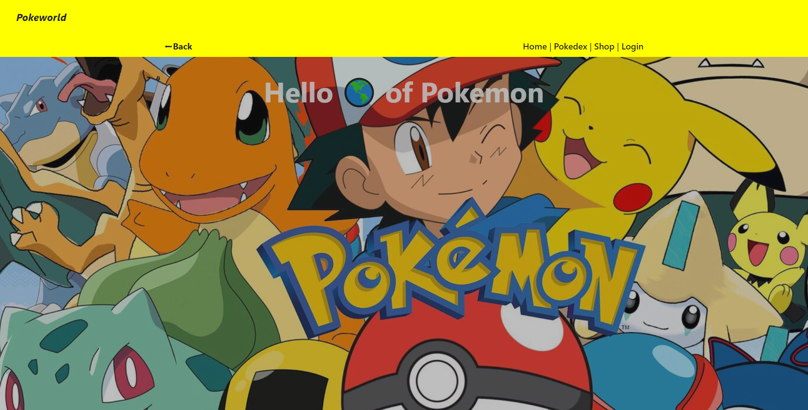
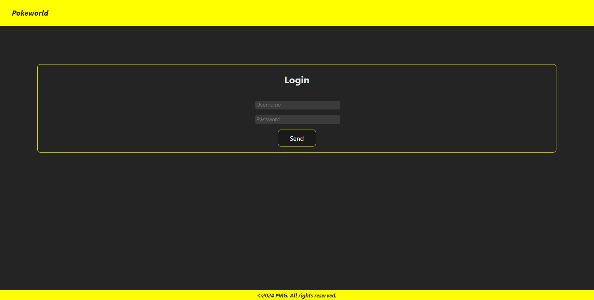
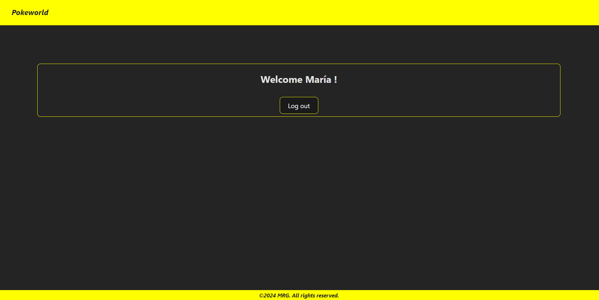

# React Project: Pokeworld

## Comenzando 🚀

Proyecto ecommerce de Pokemon que inicialmente comenzó como una forma de llevar a la práctica los conocimientos adquiridos de React.

- Estado del proyecto: En desarrollo.

## Imágenes:

### Home

### Pokedex 
La Pokedex hasta el momento muestra diferentes pokemon en tarjetas, obtenidas por consumición de la API pokeapi, y a las cuales se les puede dar like.   

### Shop
El Shop muestra diferentes productos ofrecidos en la página con su stock correspondiente, nombre y precio. Hasta el momento permite agregar al carrito la cantidad de productos que se desee siempre y cuando respete el limite de stock disponible. En caso de no quedar o existir stock del producto se visualiza un alert que informa dicha situación.

### Login
El Login ofrece un formulario para el caso que el usuario ya se hubiera registrado -Hasta el momento la página de registro no está disponible por lo que el login se realiza sin validación previa de usuario registrado. Actualmente una vez que se ingresa un nombre de usuario y una contraseña (que debe contener 6 caracteres como minimo y uno de ellos debe ser un numero), y se envía dicho formulario, logra visualizarse un mensaje de benvenida y un botón para desloguearse.

#### Prácticas resueltas de acuerdo al commit

- C2: Hello world.

- C4: Crear un componente usando prop children y fragment, y enviar una variable que contenga un nombre como prop e inserte un children escrito Hello. Devolver el mensaje, por ejemplo: Hola Juan. Recordemos que Hola son los niños y Juan es enviado como prop.

- C6: puesta en practica de prop key, map() y modulos estilizados.

- C7: puesta en practica de hook useState().

- C8: puesta en practica de eventos, formularios y validaciones. Desarrollo de header y footer junto con sus estilos.

- C13: puesta en practica de useEffect en formulario y Bienvenida al usuario.

- C14: peticiones asíncronas a API pokeapi utilizando librería axios.

- C16: ruteo con React Router. Se agregaron Shop Page y ShopCard component.

## Construido con 🛠️

React framework utilizando Vite 

## Autores ✒️

María Rosa Gervasoni - Desarrollo y Documentación - marugervasoni

#### Muchas Gracias 🎁

#### ⌨️ con ❤️ por marugervasoni 😊